# part 1: exploration

in this document, i will explore the 2021 canada census to identify
factors that impact the prevalence of low income according to various
low income lines the census uses:

- LIM-AT (low income measure, after tax) – low income determined by
  whether individual income controlled by household size is below
  national income median (after tax)

- LICO-AT (low income cut-off, after tax) – determined by whether
  economic family spends more than 20 percent point on necessities than
  national average (after tax)

notes:

- population is studied rather than economic families or households

- study encompasses all provinces and territories in canada

- “income” includes wages, social benefits, and more

## set up

``` r
librarian::shelf(cancensus,dplyr,tidyverse,stringr)
options(cancensus.api_key='CensusMapper_ff5a432202dd99dc8ab9d5bdc5d40870')

list_census_datasets()

# StatCan 2021 Census
dataset_id <- 'CA21'
```

## find relevant variables

region level note: chose to study top 10 CSDs in Canada (census
subdivisions).

    ##     geouid      region_name population
    ## 1  3520005      Toronto (C)    2794356
    ## 2  2466023     Montréal (V)    1762949
    ## 3  4806016     Calgary (CY)    1306784
    ## 4  3506008      Ottawa (CV)    1017449
    ## 5  4811061    Edmonton (CY)    1010899
    ## 6  4611040    Winnipeg (CY)     749607
    ## 7  3521005 Mississauga (CY)     717961
    ## 8  5915022   Vancouver (CY)     662248
    ## 9  3521010    Brampton (CY)     656480
    ## 10 3525005     Hamilton (C)     569353

``` r
# 01. regions
regions <- list_census_regions(dataset = dataset_id)

# top 10 CSDs by population
regions_list <- regions |> filter(level == "CSD") |> slice_max(pop,n = 10)

# 02. vectors
all_vectors <- list_census_vectors(dataset_id)

all_vectors_exp <- all_vectors

vectors_list <- rbind(
  # age
  all_vectors_exp |> filter(grepl("Total - Age",details)) |> filter(type == "Total") |> filter(str_count(details,";") <= 3),
  
  # income
  all_vectors_exp |> filter(grepl("Income",details)) |> filter(type == "Total") |> filter(grepl("After-tax income groups in 2020 for the population aged 15 years ",details,TRUE)) |> filter(grepl("100% data",details,TRUE)) |> filter(str_count(details,";") <= 8),
  
  ## median & avg
  all_vectors_exp |> filter(grepl("Income",details) & type == "Total" & grepl("recipients aged 15 years and over",details,TRUE) & grepl("after-tax",details,TRUE) & grepl("2020",details,TRUE) & str_count(details,";") <= 8),
  
  # poverty rate
  all_vectors_exp |> filter(grepl("low income status",details, TRUE) & type == "Total" & grepl("after tax",details,TRUE) & str_count(details,";") <= 8),
  
  # immigration
  all_vectors_exp |> filter(grepl("immigration",details, TRUE) & type == "Total" & (grepl("generation status",details,TRUE) | grepl("total - citizenship for the population",details,TRUE)) & str_count(details,";") <= 8)
)

rm (all_vectors_exp)
```

## pull census data

``` r
is_first <- TRUE

region <- ""

for (region in regions_list$region) {
 census_data <- get_census (dataset = dataset_id,
                          regions = list(CSD = region),
                          geo_format = NA,
                          level = 'Regions',
                          vectors = vectors_list$vector)
 
 print(c("printed: ",region))
 
 if(is_first) {
   
   is_first <- FALSE
   
   census_data_full <- census_data
 } else {
   census_data_full <- rbind(census_data_full,census_data)
 }
 
}

rm(census_data)

census_data_full <- census_data_full[,-15]

write.csv(census_data_full,"./db_census21_top10cds.csv")

# workable data
db <- census_data_full
```

## data tidying

``` r
# temporary db for column names
db_cols <- data.frame (old = colnames(db)) |> mutate (id = row_number())
db_cols <- db_cols |>
  mutate(new = tolower(old)) |>
  mutate(new = str_trim(str_remove(new,"^[^:]*:")))

db_cols$new[11] <- "age_total"
for (n in 12:14) {
  db_cols$new[n] <- paste0("age_",db_cols$new[n])
  db_cols$new[n] <- str_replace(db_cols$new[n]," years","")
  db_cols$new[n] <- str_replace(db_cols$new[n]," to ","-")
  db_cols$new[n] <- str_replace(db_cols$new[n],"  and over","+")
  db_cols$new[n] <- str_trim(db_cols$new[n])
}

db_cols$new[15] <- "income_total"
for (n in 18:30) {
  db_cols$new[n] <- paste0("income_",db_cols$new[n])
  db_cols$new[n] |>
    str_replace(" to ","-") |>
    str_replace("-\\$","-") |>
    str_replace("\\$"," ") |>
    str_replace(" and over","+") |>
    str_trim()
}


db_cols$new[15] <- "income_total"
db_cols$new[31] <- "income median_total"
db_cols$new[32] <- "income median"
db_cols$new[33] <- "income avg_total"
db_cols$new[34] <- "income avg"


db_cols$new[35] <- "lim-at_prop_total"
for (n in 36:39) {
  db_cols$new[n] <- paste0("lim-at_prop_",db_cols$new[n])
  db_cols$new[n] <- str_replace(db_cols$new[n]," years","")
  db_cols$new[n] <- str_replace(db_cols$new[n]," to ","-")
  db_cols$new[n] <- str_replace(db_cols$new[n]," and over","+")
  db_cols$new[n] <- str_trim(db_cols$new[n])
}


db_cols$new[40] <- "lim-at_prev_total"
for (n in 41:44) {
  db_cols$new[n] <- paste0("lim-at_prev_",db_cols$new[n])
  db_cols$new[n] <- str_replace(db_cols$new[n]," years","")
  db_cols$new[n] <- str_replace(db_cols$new[n]," to ","-")
  db_cols$new[n] <- str_replace(db_cols$new[n]," and over","+")
  db_cols$new[n] <- str_trim(db_cols$new[n])
}


db_cols$new[45] <- "lico-at_prop_total"
for (n in 46:49) {
  db_cols$new[n] <- paste0("lico-at_prop_",db_cols$new[n])
  db_cols$new[n] <- str_replace(db_cols$new[n]," years","")
  db_cols$new[n] <- str_replace(db_cols$new[n]," to ","-")
  db_cols$new[n] <- str_replace(db_cols$new[n]," and over","+")
  db_cols$new[n] <- str_trim(db_cols$new[n])
}


db_cols$new[50] <- "lico-at_prev_total"
for (n in 51:54) {
  db_cols$new[n] <- paste0("lico-at_prev_",db_cols$new[n])
  db_cols$new[n] <- str_replace(db_cols$new[n]," years","")
  db_cols$new[n] <- str_replace(db_cols$new[n]," to ","-")
  db_cols$new[n] <- str_replace(db_cols$new[n]," and over","+")
  db_cols$new[n] <- str_trim(db_cols$new[n])
}


db_cols$new[55] <- "citizenship_total"
db_cols$new[56] <- "citizenship_citizens"
db_cols$new[59] <- "citizenship_not citizens"
db_cols$new[60] <- "generation_total"

for (n in 61:63) {
  db_cols$new[n] <- str_replace(db_cols$new[n]," generation","")
  db_cols$new[n] <- str_replace(db_cols$new[n]," or more","+")
  db_cols$new[n] <- paste0("generation_",db_cols$new[n])
  db_cols$new[n] <- str_trim(db_cols$new[n])
}


db_cols$new[18] <- "income_under 10,000"

for (i in 1:nrow(db_cols)) {
  
  colnames(db)[i] <- db_cols$new[i]
  
}

db <- db |> rename_with(~ str_trim(.x)) |> rename_with(~ gsub("[, -]", "_", .x)) |> rename_with(~ gsub("[+]", "plus", .x)) |> rename (area = `area_(sq_km)`)
```

## data exploration

``` r
db_exp <- db |>
  mutate (
    proportion_u10 = round(income_under_10_000/income_total*100,1),
    proportion_lowinc = round(rowSums(db[18:21])/income_total*100,1),
    proportion_o125 = round(income_125_000plus/income_total*100,1),
    proportion_notcitizens = round(citizenship_not_citizens/citizenship_total*100,1),
    prop_generation_first = round(generation_first/generation_total,1),
    proportion_age65 = round(age_65plus/age_total*100,1)
    )
  # select(
  #   `region name`,
  #   proportion_u10,
  #   proportion_o125,
  #   proportion_notcitizens,
  #   `income median`,
  #   `lim-at_prev_total`
  #   )

# db_exp |> mutate(proportion_lowinc = round(rowSums(db[18:21])/income_total*100,1)) |> select(proportion_lowinc)
```

``` r
db_exp |>
  ggplot(aes(proportion_age65,lim_at_prev_total)) +
  geom_point(aes(color = region_name), size = 3) +
  stat_smooth(method = "lm", formula = y ~ x, se = FALSE,linewidth = 1,color="black") +
  labs(x = "% population age 65+", y = "% total low income by lim-at")

db_exp |>
  ggplot(aes(lim_at_prev_65plus,lim_at_prev_total)) +
  geom_point(aes(color = region_name), size = 3) +
  stat_smooth(method = "lm", formula = y ~ x, se = FALSE,linewidth = 1,color="black") +
  labs(x = "% age 65+ low income by lim-at", y = "% total low income by lim-at")
```

<div class="figure" style="text-align: center">

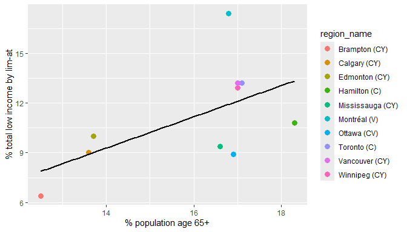
<p class="caption">
Figure 1: Relationship between low income prevalence (according to
LIM-AT) in total population vs proportion of population age 65+
</p>

</div>

<div class="figure" style="text-align: center">

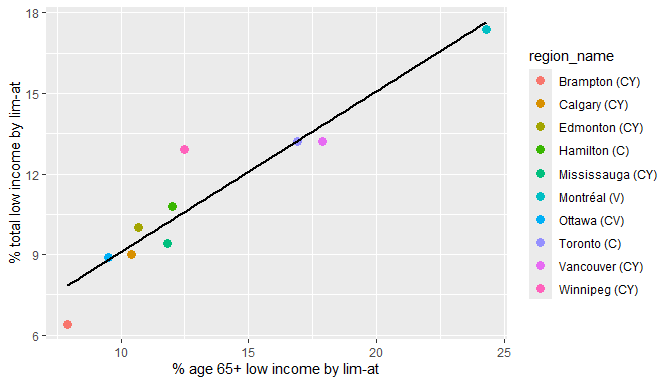
<p class="caption">
Figure 2: Relationship between low income prevalence (according to
LIM-AT) in total population vs low income prevalence (according to
LIM-AT) in population age 65+
</p>

</div>

``` r
# linear regression

model <- lm(lim_at_prev_total ~ proportion_age65,
            data = db_exp)
summary(model)

model <- lm(lim_at_prev_total ~ lim_at_prev_65plus,
            data = db_exp)
summary(model)
```

*Low income prevalence = (Co-eff.) \* (Proportion age 65+)*

|                    |              |                |             |                 |
|--------------------|:-------------|----------------|-------------|-----------------|
|                    | **Estimate** | **Std. Error** | **t value** | **Pr(\>\|t\|)** |
| (Intercept)        | -3.8825      | 7.4312         | -0.522      | 0.6155          |
| Proportion age 65+ | 0.9406       | 0.4629         | 2.032       | 0.0766          |

*Low income prevalence = (Co-eff.) \* (Low income prevalence among age
65+)*

|  |  |  |  |  |
|----|:---|:---|:---|:---|
|  | **Estimate** | **Std. Error** | **t value** | **Pr(\>\|t\|)** |
| (Intercept) | 3.10693 | 1.02156 | 3.041 | 0.016 \* |
| Low income prevalence among age 65+ (LIM-AT) | 0.59844 | 0.07203 | 8.308 | 3.32e-05 \*\*\* |

(Significance codes: \* \<0.05, \*\* \<0.01, \*\*\* \<0.001)

## part 1 conclusions:

- there is a moderate relation btwn low income % (determined by lim-at)
  & proportion of seniors
  - graph = moderate relation
  - linreg = not stat sig
  - meaning = possible the more seniors make up a population, the more
    prevalent low income is in total population
- there is a strong relation btwn low income total % & low income %
  senior (determined by lim-at)
  - graph = strong relation
  - linreg = \<0.001 stat sig
  - meaning = total % low income can predict senior % low income

# part 2: bigger sample

i want to look at relations btwn poverty & senior proportion beyond top
10 CSD to get a bigger sample. i will pull data from all 293 CD (census
divisions).

    ## # A tibble: 13 × 2
    ##    province                  `# census divisions`
    ##    <chr>                                    <int>
    ##  1 Quebec                                      98
    ##  2 Ontario                                     49
    ##  3 British Columbia                            29
    ##  4 Manitoba                                    23
    ##  5 Alberta                                     19
    ##  6 Nova Scotia                                 18
    ##  7 Saskatchewan                                18
    ##  8 New Brunswick                               15
    ##  9 Newfoundland and Labrador                   11
    ## 10 Northwest Territories                        6
    ## 11 Nunavut                                      3
    ## 12 Prince Edward Island                         3
    ## 13 Yukon                                        1

## find relevant variables

``` r
# all csds
regions_list_02 <- regions |> filter(level == "CD")

# 02. vectors
vectors_list_02 <- c("v_CA21_8","v_CA21_251","v_CA21_1085","v_CA21_1097","v_CA21_1040", "v_CA21_1052")

# immigrant generations: "v_CA21_4818","v_CA21_4821","v_CA21_4824","v_CA21_4827"
```

## pull census data

``` r
is_first <- TRUE

rm(region)
rm(census_data)

for (region in regions_list_02$region) {
 census_data <- get_census (dataset = dataset_id,
                          regions = list(CD = region),
                          geo_format = NA,
                          level = 'Regions',
                          vectors = vectors_list_02_missing,
                          quiet = TRUE)
 
 if(is_first) {
   
   is_first <- FALSE
   
   census_data_full_02 <- census_data
 } else {
   census_data_full_02 <- rbind(census_data_full_02,census_data)
 }
 
 
}

rm(census_data)

# write.csv(census_data_full_02,"./db_census21_alcd.csv")

# workable data
db_02 <- census_data_full_02
```

## data tidying

``` r
db_02 <- db_02 |> rename_with(~ tolower(.x))

db_02 <- db_02 |>
  rename (
    age_total = 10,
    age_65plus = 11,
    limat_total = 12,
    limat_65plus = 13,
    licoat_total = 14,
    licoat_65plus = 15
  )

db_02 <- db_02 |> rename_with(~ str_replace_all(.x," ","_"))

db_02 <- rename(db_02,area = `area_(sq_km)`)
```

``` r
# separate by province
provinces_code <- regions |> filter(level == "PR") |> select(region,name)
db_02_exp <- left_join(db_02_exp,provinces_code,join_by(pr_uid == region)) |> rename(province = name)
db_02_exp <- db_02_exp |> relocate(province, .after =region_name)


# proportion of senior population/total population
db_02_exp <- db_02_exp |>
  mutate (
    prop_age65 = round(age_65plus/age_total*100,1)
  )

db_02_exp$province <- as.factor(db_02_exp$province)
db_02_exp$province <- relevel(db_02_exp$province, ref = "Ontario")
```

## data analysis

``` r
# summary of population count across dataset to understand scope
summary(db_02_exp$population)

# list of regions with na in k
db_02_exp |>
  filter(if_any(c(prop_age65,limat_total,limat_65plus,licoat_65plus,licoat_total),is.na)) |>
  select (geouid,region_name,province,prop_age65,limat_total,limat_65plus,licoat_65plus,licoat_total)

# provincial summary
db_02_exp |>
  group_by(province) |>
  summarise(
    avg_limat_total = round(mean(limat_total,na.rm = TRUE),1),
    avg_limat_65plus = round(mean(limat_65plus,na.rm = TRUE),1),
    count = n()
  ) |>
  arrange(desc(count))
```

    ##    Min. 1st Qu.  Median    Mean 3rd Qu.    Max. 
    ##     683   20547   40684  126252   89770 2794356

    ##    geouid           region_name                  province prop_age65
    ## 1    6001           Yukon (TER)                     Yukon       15.0
    ## 2    6106        Region 6 (REG)     Northwest Territories        8.0
    ## 3    6204     Qikiqtaaluk (REG)                   Nunavut        4.1
    ## 4    6205        Kivalliq (REG)                   Nunavut        4.3
    ## 5    6208       Kitikmeot (REG)                   Nunavut        5.4
    ## 6    6105        Region 5 (REG)     Northwest Territories       14.4
    ## 7    6101        Region 1 (REG)     Northwest Territories       10.3
    ## 8    4623 Division No. 23 (CDR)                  Manitoba        7.4
    ## 9    6104        Region 4 (REG)     Northwest Territories       15.3
    ## 10   6103        Region 3 (REG)     Northwest Territories        9.1
    ## 11   1011 Division No. 11 (CDR) Newfoundland and Labrador        9.5
    ## 12   6102        Region 2 (REG)     Northwest Territories       10.2
    ##    limat_total limat_65plus licoat_65plus licoat_total
    ## 1          7.6         13.2            NA           NA
    ## 2          4.4          5.6            NA           NA
    ## 3         14.3         10.6            NA           NA
    ## 4         14.8          8.5            NA           NA
    ## 5         16.0          7.6            NA           NA
    ## 6          7.1          8.8            NA           NA
    ## 7         13.3         15.0            NA           NA
    ## 8         23.4         23.0            NA          3.4
    ## 9         10.7         13.2            NA           NA
    ## 10        10.4          5.0            NA           NA
    ## 11        21.5         32.0            NA          2.5
    ## 12         7.8          8.0            NA           NA

    ## # A tibble: 13 × 4
    ##    province                  avg_limat_total avg_limat_65plus count
    ##    <chr>                               <dbl>            <dbl> <int>
    ##  1 Quebec                               12.3             22.1    98
    ##  2 Ontario                              10.8             12.1    49
    ##  3 British Columbia                     12.1             15.1    29
    ##  4 Manitoba                             17.2             18.1    23
    ##  5 Alberta                              10.6             12.5    19
    ##  6 Nova Scotia                          17.6             23.8    18
    ##  7 Saskatchewan                         15.6             17.7    18
    ##  8 New Brunswick                        14.9             22.4    15
    ##  9 Newfoundland and Labrador            18               29.7    11
    ## 10 Northwest Territories                 8.9              9.3     6
    ## 11 Nunavut                              15                8.9     3
    ## 12 Prince Edward Island                 14.4             21.2     3
    ## 13 Yukon                                 7.6             13.2     1

``` r
# lico vs lim total
db_02_exp |>
  drop_na(prop_age65,licoat_65plus,licoat_total) |>
  ggplot(aes(licoat_total,limat_total)) +
  geom_point(color = "blue") +
  stat_smooth(method = "lm", formula = y ~ x, se = FALSE,linewidth = 1,color="black") +
  labs(x = "total low income prevalence by lico-at (%)", y = "total low income prevalence by lim-at (%)")
```

<div class="figure" style="text-align: center">

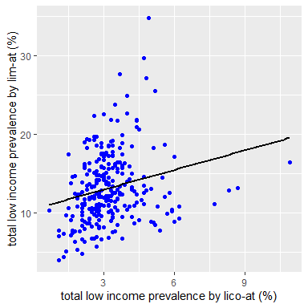
<p class="caption">
Figure 3: Relationship between low income prevalence according to
LICO-AT vs according to LIM-AT in total population
</p>

</div>

``` r
# by lim-at = based on median income adjusted to household size (after tax)
# senior proportion, low income total proportion
db_02_exp |>
#  drop_na(prop_age65,licoat_65plus,licoat_total) |>
  ggplot(aes(prop_age65,limat_total)) +
  geom_point(color = "blue") +
  stat_smooth(method = "lm", formula = y ~ x, se = FALSE,linewidth = 1,color="black") +
  labs(x = "% population age 65+", y = "% total low income by lim-at")

# senior proportion, low income senior proportion
db_02_exp |>
#  drop_na(prop_age65,licoat_65plus,licoat_total) |>
  ggplot(aes(prop_age65,limat_65plus)) +
  geom_point(color = "darkgreen") +
  stat_smooth(method = "lm", formula = y ~ x, se = FALSE,linewidth = 1,color="black") +
  labs(x = "% population age 65+", y = "% age 65+ low income by lim-at")

# low income senior proportion, low income total proportion
db_02_exp |>
#  drop_na(prop_age65,licoat_65plus,licoat_total) |>
  ggplot(aes(limat_65plus,limat_total)) +
  geom_point(color = "red") +
  stat_smooth(method = "lm", formula = y ~ x, se = FALSE,linewidth = 1,color="black") +
  labs(x = "% age 65+ low income by lim-at", y = "% total low income by lim-at")
```

<div class="figure" style="text-align: center">

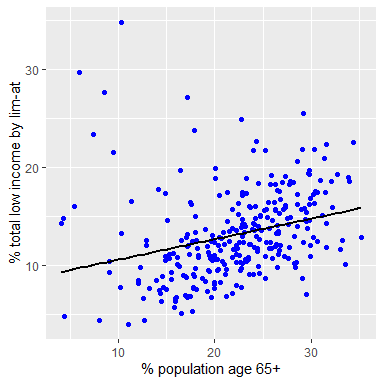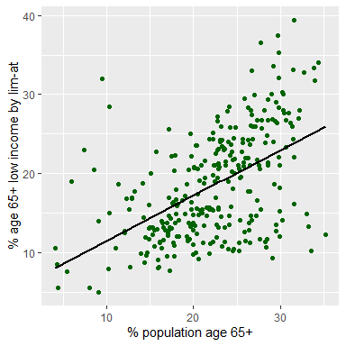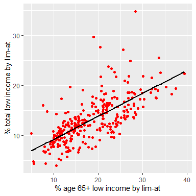
<p class="caption">
Figure 4: Low income evaluated by LIM-AT. (a) Senior proportion by total
low income prevalence (b) Senior proportion by senior low income
prevalence (c) senior low income prevalence by total low income
prevalence
</p>

</div>

``` r
# by lico-at = based on spending on necessities, 20 percent points more than average
# senior proportion, low income total proportion
db_02_exp |>
  drop_na(prop_age65,licoat_65plus,licoat_total) |>
  ggplot(aes(prop_age65,licoat_total)) +
  geom_point(color = "blue") +
  stat_smooth(method = "lm", formula = y ~ x, se = FALSE,linewidth = 1,color="black") +
  labs(x = "% population age 65+", y = "% total low income by lico-at")

# senior proportion, low income senior proportion
db_02_exp |>
  drop_na(prop_age65,licoat_65plus,licoat_total) |>
  ggplot(aes(prop_age65,licoat_65plus)) +
  geom_point(color = "darkgreen") +
  stat_smooth(method = "lm", formula = y ~ x, se = FALSE,linewidth = 1,color="black") +
  labs(x = "% population age 65+", y = "% age 65+ low income by lico-at")

# low income senior proportion, low income total proportion
db_02_exp |>
  drop_na(prop_age65,licoat_65plus,licoat_total) |>
  ggplot(aes(licoat_65plus,licoat_total)) +
  geom_point(color = "red") +
  stat_smooth(method = "lm", formula = y ~ x, se = FALSE,linewidth = 1,color="black") +
  labs(x = "% age 65+ low income by lico-at", y = "% total low income by lico-at")
```

<div class="figure" style="text-align: center">

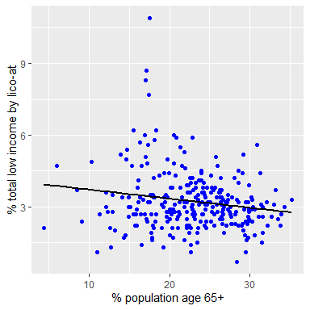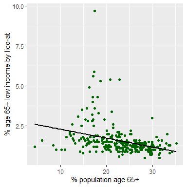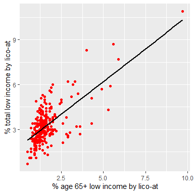
<p class="caption">
Figure 5: Low income evaluated by LICO-AT. (a) Senior proportion by
total low income prevalence (b) Senior proportion by senior low income
prevalence (c) senior low income prevalence by total low income
prevalence
</p>

</div>

``` r
# split by province
db_02_exp |>
  drop_na(prop_age65,licoat_65plus,licoat_total) |>
  ggplot(aes(prop_age65,limat_total)) +
  geom_point(size = 1) +
  stat_smooth(method = "lm", formula = y ~ x, se = FALSE,linewidth = 1,color="blue") +
  labs(x = "% population age 65+", y = "% total low income by lim-at") +
  facet_wrap(~ province)
db_02_exp |>
  drop_na(prop_age65,licoat_65plus,licoat_total) |>
  ggplot(aes(prop_age65,licoat_total)) +
  geom_point(size = 1) +
  stat_smooth(method = "lm", formula = y ~ x, se = FALSE,linewidth = 1,color="blue") +
  labs(x = "% population age 65+", y = "% total low income by lico-at") +
  facet_wrap(~ province)
```

<div class="figure" style="text-align: center">

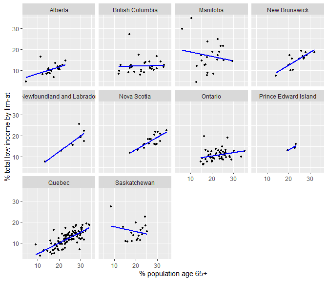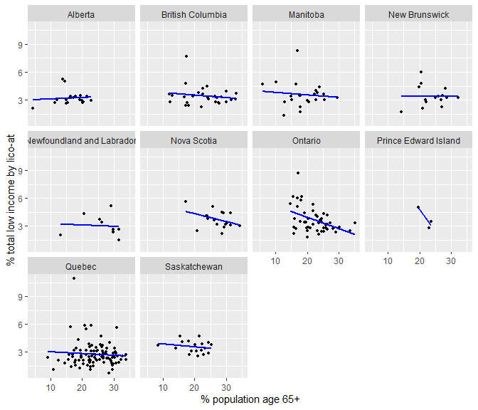
<p class="caption">
Figure 6: Split by province. (a) Senior proportion by total low income
prevalence (LIM-AT) (b) Senior proportion by total low income prevalence
(LICO-AT)
</p>

</div>

``` r
# linear regression

#db_02_exp$province <- relevel(db_02_exp$province, ref = "Ontario")
#filter(db_02_exp,province=="Ontario")

model <- lm(limat_total ~ prop_age65,
            data = db_02_exp)
summary(model)

model <- lm(licoat_total ~ prop_age65,
            data = db_02_exp)
summary(model)

#plot(model)
```

*Low income prevalence by LIM-AT = (Co-eff.) \* (Proportion age 65+)*

|                    |              |                |             |                 |
|--------------------|:-------------|----------------|-------------|-----------------|
|                    | **Estimate** | **Std. Error** | **t value** | **Pr(\>\|t\|)** |
| (Intercept)        | 8.48212      | 0.95452        | 8.886       | \< 2e-16 \*\*\* |
| Proportion age 65+ | 0.20942      | 0.04142        | 5.055       | 7.61e-07 \*\*\* |

*Low income prevalence by LICO-AT = (Co-eff.) \* (Proportion age 65+)*

|                    |              |                |             |                 |
|--------------------|:-------------|:---------------|:------------|:----------------|
|                    | **Estimate** | **Std. Error** | **t value** | **Pr(\>\|t\|)** |
| (Intercept)        | 4.03631      | 0.29456        | 13.703      | \< 2e-16 \*\*\* |
| Proportion age 65+ | -0.03558     | 0.01261        | -2.822      | 0.00511 \*\*    |

(Significance codes: \* \<0.05, \*\* \<0.01, \*\*\* \<0.001)

``` r
# by province: quebec
model <- lm(limat_total ~ prop_age65,
            data = filter(db_02_exp,province=="Quebec"))
summary(model)

model <- lm(licoat_total ~ prop_age65,
            data = filter(db_02_exp,province=="Quebec"))
summary(model)
```

*IN QUEBEC: Low income prevalence by LIM-AT = (Co-eff.) \* (Proportion
age 65+)*

|                    |              |                |             |                 |
|--------------------|:-------------|----------------|-------------|-----------------|
|                    | **Estimate** | **Std. Error** | **t value** | **Pr(\>\|t\|)** |
| (Intercept)        | -0.002056    | 1.177384       | -0.002      | 0.999           |
| Proportion age 65+ | 0.512086     | 0.047914       | 0.688       | \<2e-16 \*\*\*  |

*IN QUEBEC: Low income prevalence by LICO-AT = (Co-eff.) \* (Proportion
age 65+)*

|                    |              |                |             |                 |
|--------------------|:-------------|:---------------|:------------|:----------------|
|                    | **Estimate** | **Std. Error** | **t value** | **Pr(\>\|t\|)** |
| (Intercept)        | 3.20101      | 0.63092        | 5.074       | 1.91e-06 \*\*\* |
| Proportion age 65+ | -0.01852     | 0.02568        | -0.721      | 0.472           |

(Significance codes: \* \<0.05, \*\* \<0.01, \*\*\* \<0.001)

## part 2 conclusion:

- significant relationship btwn total poverty and proportion of seniors
  in population
  - different relationships if low income is determined by lico-at or
    lim-at
  - lim-at: direct, strong – by national median, household size
  - lico-at: inverse, weaker – by spending power (national stat)
- there are also differences when study is split by province
  - different sample sizes (as number of CDs change by province) makes
    some provinces/territories harder to study (ie. yukon only one CD,
    with no lico-at data) or less accurate than others (ie. quebec has a
    bigger sample size \[98\] than british columbia \[29\])
- curious about:
  - controls to improve R^2, prediction, & status of significance
    - ie. lim-at should be controlled by region’s median income (census
      vectors: “v_CA21_563”,“v_CA21_566”) since
  - change & contrasts if scaled deeper
  - why do different provinces have different results?
  - big difference btwn lico-at vs lim-at

# **Sample final conclusion**

Quebec has the highest sample by province (98 regions). An isolated
study found that as the proportion of seniors increased, there is a
statistically significant probability of the prevalence of low income in
the total population increasing – according to LIM-AT but not LICO-AT.

This indicates that as the Quebec population grows older, the population
earns less income and has less means to support their household.
However, the population spending power may not be impacted. The
suggestion is that social programs are working to prevent seniors (and
their households/families) from diminished spending power despite lower
income.

According to basic linear regression models, in Canada, as the
proportion of seniors (age 65+) grows by 1%, the prevalence of low
income according to LIM-AT grows by 0.21%. In Quebec, the prevalence of
low income according to LIM-AT grows by 0.51%. Therefore, population age
may have a greater impact in Quebec over other regions. One reason why
may be a study design fault, the inadequate sample size by province.
Reasons related to senior social assistance (ie. do more seniors work
less in Quebec because of increased social assistance?) & living
conditions (ie. do seniors live in larger households in Quebec?) should
be studied.
